# Documentation - Travel tickets system
Овој проект претставува систем за купување на патнички билети за воз или автобус. За креирање на истиот користев 2 плочки - `STM32H750-DK` и `STM32F103-RB`, на првата плочка е конфигуриран дисплеј со различни екрани кој корисниците ќе го користат за навигирање низ системот, втората плочка служи само за справување со плаќањето и читање од RFID картичка.
Документацијата ќе ја поделам на неколку делови  за првата плочка и за втората плочка:
- Објаснување на екраните од дисплејот
- Опишување на функционалности за комуникација помеѓу екран и плочка, како и меѓу двете плочки.
- Цел циклус на можни настани при користење на екранот.

Кодот за двете плочки и TouchGFX се ставени на посебни гранки на репозиториумот.
На следното видео може да се виде демонстрација на TouchGFX од симулаторот: https://youtu.be/8ZZec6rxNfM

## STM32H750-DK
На оваа плочка е конфигуриран дисплејот. Подолу ќе го опишам секој екран и компонентите на истиот.
### Main Screen
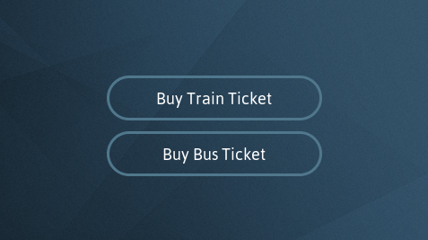

Најпрво кога ќе се стартува системот сме навигирани на овој екран. Тука има само две копчиња - едно за купување на патнички билет за воз, а другото копче не води до купување на автобуски билет. Во `Interactions` може да видиме дека копчињата се само конфигурирани да пренасочуваат до друг екран и толку. 
### Train Ticket Screen
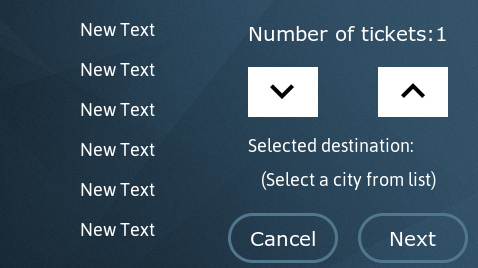

Ова е екранот на кој корисникот ќе биде однесен доколку стисне на копчето за билет за воз. На овој екран има повеќе компоненти. Лево има компонента од типот `ScrollList`. Како елемент на таа компонента користам custom Container кој е всушност само текст поле. За печатење на елементите се прикажуваат елементите кои се наоѓаат во `Texts` во `TouchGFX Designer`:
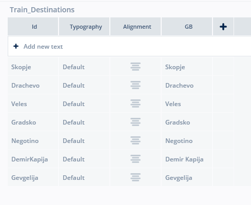
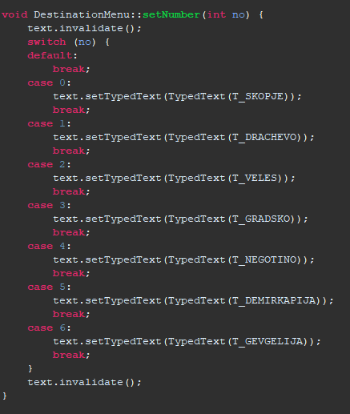
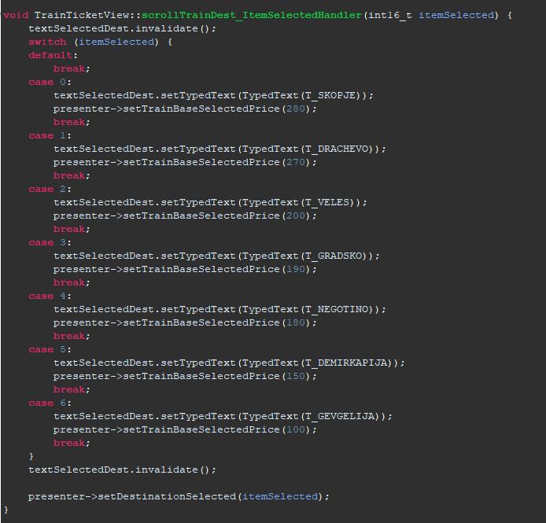

Тука исто така се подесуваат и цените за секоја од дестинациите. Потоа на истиот екран при клик на некоја од дестинациите, истата се испечатува повторно на едно од текст полињата над копчињата `Cancel` и `Next`. Овде корисникот може да одбере и број на билети со помоч на копчињата стрелки, нагоре(+) и надолу(-).
При кликање на копчето `Next` корисникот е пренасочен кон екранот `ReviewTicketView` каде може да си ја прегледа нарачката. Името на одбраната дестинација и бројот на карти се зачувува најпрво во `presenter` па во `model`. 
### Bus Ticket Screen
Екранот за автобус е идентичен со екранот за воз, со тоа што цената на картите е различна. 
### Review Ticket Screen
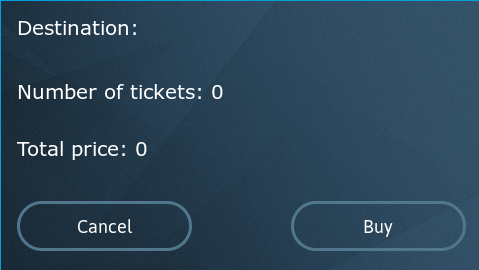

На овој екран корисникот може да ги прегледа своите избори, испечатено е името на дестинацијата која ја одбрал, бројот на карти како и вкупната цена на сите билети заедно. Има два избора или да оди кон плаќање на билетите или пак да се откаже од плаќање. Доколку кликне на копчето `Buy` се случува следното.
#### Праќање податоци до `F103-RB`
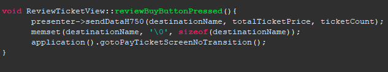

Бројот на карти, вкупната цена и дестинацијата се праќаат кон презентерот на овој екран а од таму кон моделот. 
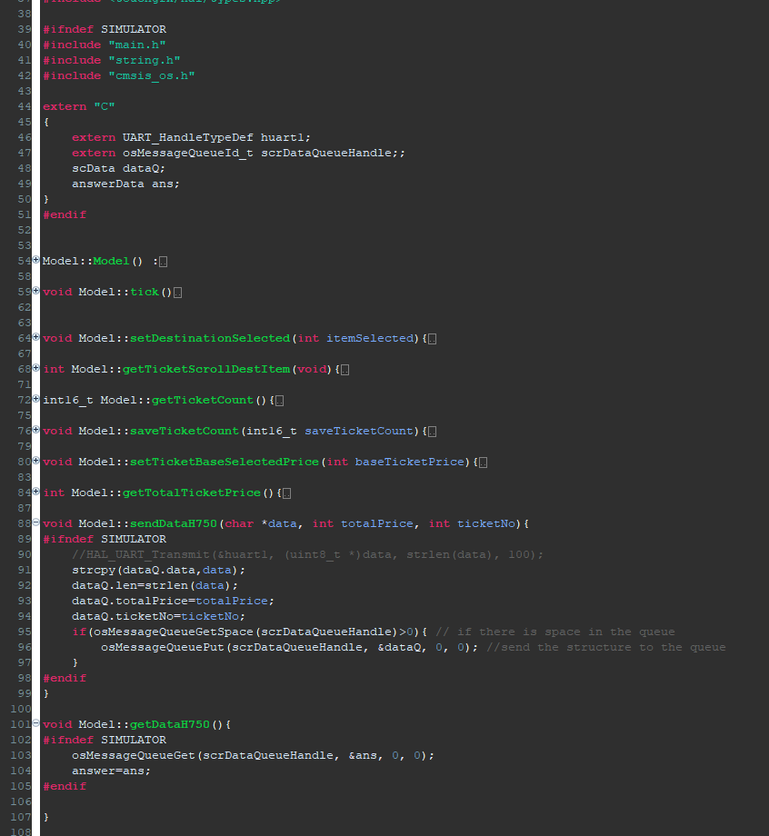

Овде најгоре дефинирам променливи од ист тип како оние кои се во `main.c` фајлот за `H750-DK` податоците ги ставам во структура која потоја ја ставам во редица.
Најдолу може да се види и функцијата за примање на податоци назад од плочката кон екранот.
(Референца за упатство: https://www.youtube.com/watch?v=4G1nDkjvkY8&t=643s)

Во `main.c` дефинирани се два таскови - `ScrDataTask` и `ReceiveDataTask`:
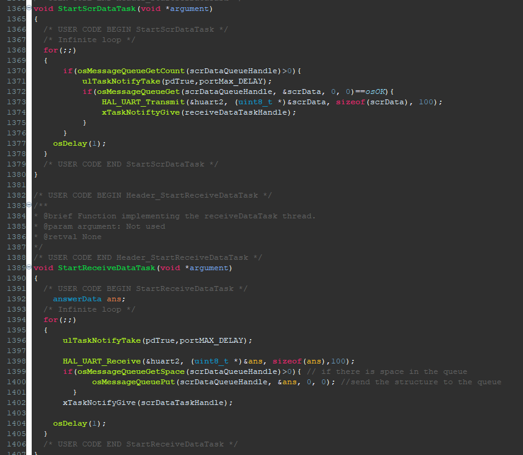

Во првиот таск се вади објектот од редицата каде што го ставивме претходно, се испраќа со `UART` протокол до другата плочка, објектот со дестинација, број на билети и сума на нарачката.
Вториот таск е обратен, се зема објект од UART каналот за комуникација и истиот се става во редицата за да може да се прочита од страна на екранот.
### Pay Ticket Screen
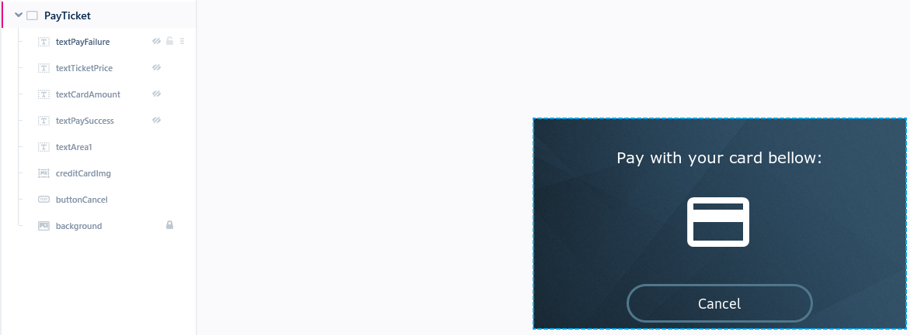
Овој екран има повеќе компоненти во него. Во зависност од податоците кои ќе ги добиеме назад од `H750-DK` ќе прикажеме различни работи. Доколку плаќањето е успешно ќе се појави текстот за успешно наплаќање, доколку не е ќе се испечати текст за неуспешно плаќање. И во двата случаи корисникот исто така добива податоци за неговата тековна сума и за сумата на билетите кои сакал да ги купи.

## STM32F103-RB
### Таскови и редици
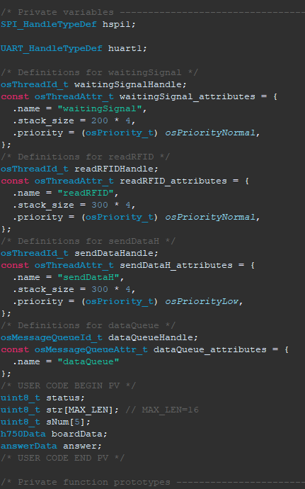

Ова се тасковите и редиците кои се користат во плочката `F103RB`. Еден таск е за чекање порака од другата плочка, еден е за читање на `RFID` картичката, еден е за праќање на податоци назад до другата плочка, тука е и редицата за податоци. Тасковите се извршуваат секвенцијално, односно доколку еден таск не заврши со работа и не му даде предност на следниот системот ќе биде закочен цело време.

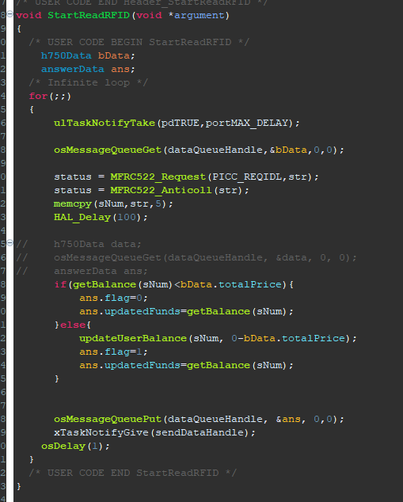

Овој таск е за читање од RFID картичка. Во истиот таск ја имам сместено и логиката за пресметување на новиот баланс на корисникот, доколку има доволно средства да плати, инаку се праќа знаменце со вредност 0 назад кон плочката H750-DK па потоа се прикажуваат соодветните податоци на екран (Pay Ticket Screen).
Со командата `uLTaskNotifyTake(pdTRUE,portMAX_DELAY)` таскот чека да добие „нотификација“ за да почне со извршување на својот код. Во кодот на овој таск се чита од RFID картичка, потоа од “базата“ од меморија се наоѓа корисникот со тој код на картичка и од неговата сума на пари доколку има доволно се одзима вредноста на сите билети, доколку нема доволно средства знаменцето се поставува на 0.

На сличен начин се програмирани и другите таскови.

### Редослед на извршување на тасковите
Редоследот на извршување на тасковите може да се види на следната слика:

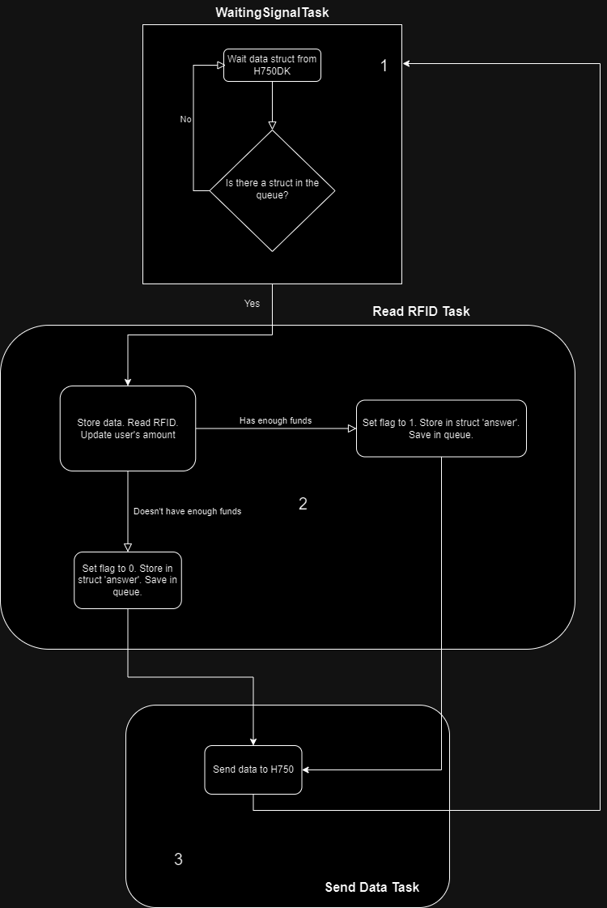

### `user.c` и `user.h`
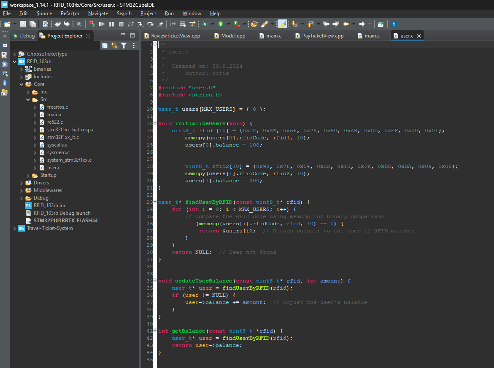

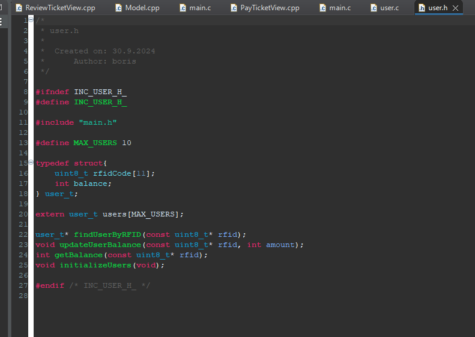
